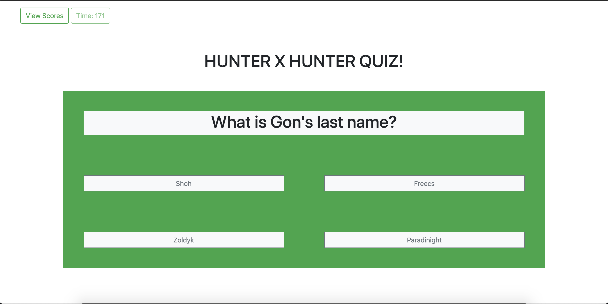
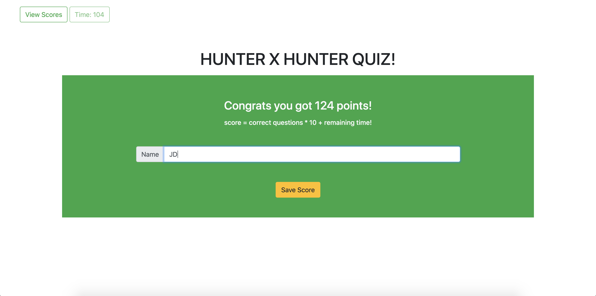
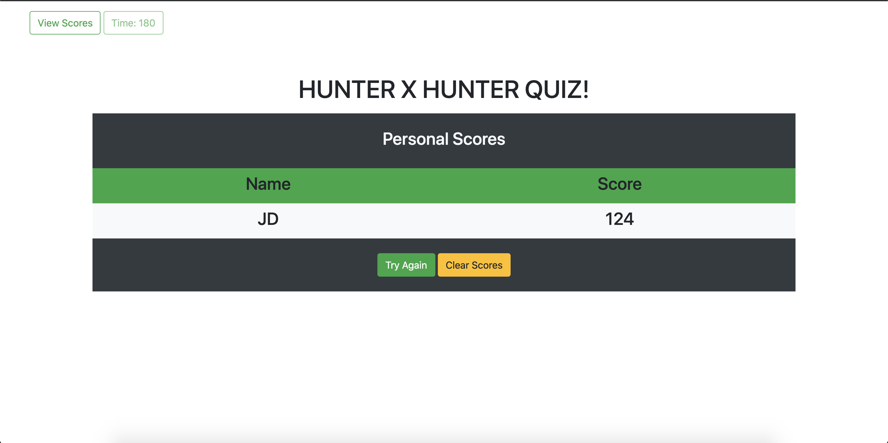

# hunterxhunter-timed-quiz

In this [project](https://goodlvn.github.io/hunterxhunter-timed-quiz/) we were prompted to create a quiz of the topic of our choice! We had to implement a lot of what we have learned so far using pure javascript. The main components of this project included a timer that keeps track of how long the quiz is going, as well as quiz questions that effect the timer and move the page forward witht the next questions. We also had to make functionality such that a user would be able to save their score and view the scores list at any point in time. We used local storage to accomplish this and also included a button that clears the saved scores from the personal scores board and local storage. This project was great because there was so many ways to go about creating the application! 

## Screenshots of project

starting screen - press button to intiate screen


main layout of quiz - bootstrap grid-system


upon complete quiz - display score and ipnut to save name


generate personal scores list with updated scores


## How to use: 

1. open in browser 
2. press start button - timer starts
3. answer questions 
4. game ends at the end of quiz or once timer runs out 
5. save name to view score on score board

* correct answer gives you one point
* wrong answer subtracts 10 seconds from timer
* can view scoreboard at any time using view scores button 

## Technolgies used 
* Javascript
* Bootstrap
* HTML
* CSS

## Why does this project stand out?

This project stands out becuase it is the most intensive code project we have worked on yet! To reiterate, there are so many ways to go about completing this quiz. We used a lot of the javascript we have been learning about in order to make this work. Some of the concepts/funcitons/componenets we used were things like; objects, arrays, local storage, JSON to string and parse, creating elements dynamically and appending them to the page, making sure that the scope of our variables were set properly, and much more. 

This project also stands out to me because it was the first one that let us combine the use of Bootstrap and javascript to create a responsive layout with dynamic behavior. 

### code highlights 

```
function createNappend(){
    var newRow = document.createElement("div");
    newRow.setAttribute("id", "wrapper-row"); 
    newRow.setAttribute("class", "row bg-light clearable"); 
    document.getElementById("playerScores").insertBefore(newRow, document.getElementById("playerScores").children[2]);

    var newColOne = document.createElement("div");
    newColOne.setAttribute("id", "name"); 
    newColOne.setAttribute("class", "col-6");
    newRow.append(newColOne);

    var newColTwo = document.createElement("div");
    newColTwo.setAttribute("id", "score"); 
    newColTwo.setAttribute("class", "col-6");
    newRow.append(newColTwo);

    var newName = document.createElement("h3");
    newName.setAttribute("class", "text-center p-2");
    newName.textContent = playerName;
    newColOne.append(newName);

    var newScore = document.createElement("h3");
    newScore.setAttribute("class", "text-center p-2");
    newScore.textContent = newPlayerScore;
    newColTwo.append(newScore);
}
```
This code is the backbone of my player score board functionality! It let me dynamically create the html elements the user would need to save their score as well as allow me to create all of the saved scores inside of the local storage upon refresh!

```
clearPS.addEventListener("click", function(event){
    event.preventDefault();
    localStorage.clear();

    var i = 0;

    while(i < clearableScores.length || i === 0){
        clearableScores[0].remove();
    }
});
```
This was the icing on the cake when it came to the player scores funcionality. I really like this peice of code because it uses a localStorage function that I had not used before. It takes variable scope into consideration allowing me to use my "i" as an iterator, and in this case the while loop was more effecient in clearing the score board than a for loop was.

## Credits 

Kevin Luo - helped me walk through the scoreboard functionality/local storage JSON madness as well as gave me the idea to re-use the large block of code I created to generate new html elements
